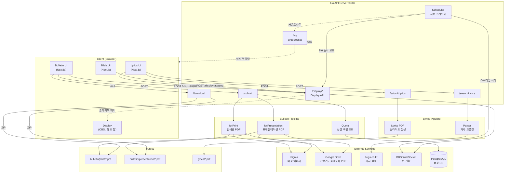
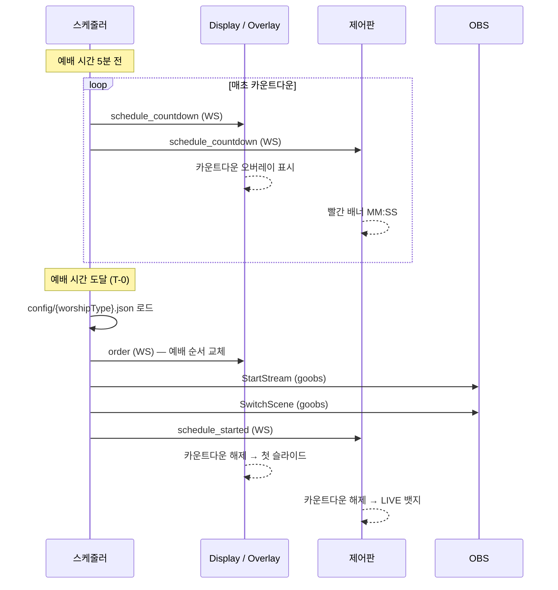

<div align="center">

# easyPreparation

**교회 주보 · 가사 PPT · 예배 화면 자동화 플랫폼**

[](https://go.dev)
[](https://nextjs.org)
[](https://www.typescriptlang.org)
[](https://recoiljs.org)
[](https://next-auth.js.org)
[](https://www.postgresql.org)

</div>

---

## Architecture


```mermaid
flowchart TD
    subgraph Client["Client (Browser)"]
        UI_B["Bulletin UI\n(Next.js)"]
        UI_L["Lyrics UI\n(Next.js)"]
        UI_BIBLE["Bible UI\n(Next.js)"]
        DISPLAY["Display\n(OBS / 별도 창)"]
    end

    subgraph Server["Go API Server :8080"]
        WS["/ws\nWebSocket"]
        SUB["/submit"]
        SUB_L["/submitLyrics"]
        SEARCH["/searchLyrics"]
        DL["/download"]
        DISP["/display/*\nDisplay API"]
        SCHED["Scheduler\n자동 스케줄러"]
    end

    subgraph Bulletin["Bulletin Pipeline"]
        B_QUOTE["Quote\n성경 구절 조회"]
        B_PRINT["forPrint\n인쇄용 PDF"]
        B_PRES["forPresentation\n프레젠테이션 PDF"]
    end

    subgraph Lyrics["Lyrics Pipeline"]
        L_CRAWL["Parser\n가사 크롤링"]
        L_PDF["Lyrics PDF\n슬라이드 생성"]
    end

    subgraph Ext["External Services"]
        FIGMA["Figma\n배경 이미지"]
        GCLOUD["Google Drive\n찬송가 / 성시교독 PDF"]
        BUGS["bugs.co.kr\n가사 검색"]
        OBS["OBS WebSocket\n씬 전환"]
        PG[("PostgreSQL\n성경 DB")]
    end

    subgraph Output["output/"]
        OUT_BP["bulletin/print/*.pdf"]
        OUT_BPR["bulletin/presentation/*.pdf"]
        OUT_L["lyrics/*.pdf"]
    end

    UI_B -->|POST| SUB
    UI_L -->|POST| SUB_L
    UI_L -->|POST| SEARCH
    UI_B -->|GET| DL
    UI_B -->|POST /display/order| DISP
    UI_L -->|POST /display/append| DISP
    UI_BIBLE -->|POST /display/append| DISP
    Server -->|progress| WS
    WS -.->|실시간 알림| Client
    DISP -.->|슬라이드 제어| DISPLAY
    SCHED -->|T-0 순서 로드| DISP
    SCHED -->|스트리밍 시작| OBS
    SCHED -.->|카운트다운| WS

    SUB --> B_QUOTE
    B_QUOTE --> PG
    SUB --> B_PRINT
    SUB --> B_PRES

    B_PRINT --> FIGMA
    B_PRES --> FIGMA
    B_PRINT --> GCLOUD
    B_PRES --> GCLOUD

    B_PRINT --> OUT_BP
    B_PRES --> OUT_BPR

    SEARCH --> L_CRAWL
    L_CRAWL --> BUGS
    SUB_L --> L_PDF
    L_PDF --> OUT_L

    DL -->|ZIP| OUT_BP
    DL -->|ZIP| OUT_BPR

    DISP --> OBS
```

---

## Features

| 기능 | 설명 |
|------|------|
| **주보 생성** | Figma 디자인 기반 인쇄용(A4) + 프레젠테이션용 PDF 자동 생성 |
| **주보 편집** | 예배 순서 드래그 앤 드롭 재배치, 성경 구절 선택, 교회 소식 트리 편집 |
| **가사 PPT 생성** | 곡명 입력 → 가사 자동 검색(bugs.co.kr) → 중복 제거 → ZIP 다운로드 |
| **찬송가 검색** | DB 기반 645곡 새찬송가 번호/제목/가사 검색, Display 전송 |
| **성경 검색** | 구약/신약 탭, 장/절 선택, 7개 번역판 지원, 비교 모드 (2컬럼) |
| **예배 화면** | OBS Browser Source 연동, 성경/찬송/교독/가사 슬라이드 실시간 표시 |
| **Display 통합 제어** | 주보/가사/성경 탭에서 append 방식으로 항목 추가, 제어판에서 삭제/점프/자동 넘김 |
| **실시간 상태** | WebSocket으로 파일 생성 진행 상황 + Display 위치 브로드캐스트 |
| **자동 스케줄러** | 예배 시간 자동 감지 → 카운트다운 → 순서 로드 → OBS 스트리밍 시작 |
| **OBS 통합 제어** | 씬 전환 + 스트리밍 시작/종료 + 상태 모니터링, 수동 제어 지원 |
| **계정 설정** | 교회 정보 편집, 선호 성경 버전/테마/폰트 설정, 생성 이력 조회 |
| **소셜 로그인** | NextAuth 기반 인증 + 교회 프로필 등록 |

---

## 스크린샷

> 주보 편집 화면 — 예배 순서 선택 → 항목 편집 → 미리보기

```
┌─────────────────────────────────────────────────────────┐
│  NavBar                                        [프로필]  │
├──────────────┬──────────────────┬───────────────────────┤
│  예배 순서   │   선택된 순서    │    생성된 예배 내용   │
│  선택하기    │                  │                       │
│  ──────────  │  [전주] [예배의] │  전주                 │
│  [전주]      │  [부름] [찬송]   │  예배의 부름  시편..  │
│  [예배의부름]│  [성시교독] ...  │  찬송        27장     │
│  [찬송]      │                  │  성시교독    31편     │
│  [성경봉독]  │   ──────────     │  ...                  │
│  ...         │   [상세 편집]    │                       │
└──────────────┴──────────────────┴───────────────────────┘
```

---

## OBS 통합 아키텍처

easyPreparation은 **콘텐츠 · 타이밍 · 제어**를 담당하고, OBS는 **인코딩 · 합성 · 송출**만 담당합니다.

```
┌─ easyPreparation (두뇌) ─────────────────┐      ┌─ OBS Studio (근육) ──────────┐
│                                           │      │                              │
│  📅 스케줄러                              │      │                              │
│  ├─ 예배 시간 자동 감지                   │      │                              │
│  ├─ T-5분: 카운트다운 시작          ──────┼──ws──┼→ 씬 전환                     │
│  └─ T-0초: 순서 로드 + 스트리밍     ──────┼──ws──┼→ 스트리밍 시작/종료          │
│                                           │      │                              │
│  🖥️ Display 렌더링                       │      │   ┌──────────────────────┐   │
│  ├─ /display (프로젝터용)           ◀─────┼──────┼── │ Browser Source #1    │   │
│  ├─ /display/overlay (방송 자막)    ◀─────┼──────┼── │ Browser Source #2    │   │
│  └─ 카운트다운 오버레이                   │      │   └──────────────────────┘   │
│                                           │      │                              │
│  🎛️ 제어판                               │      │   📹 카메라 입력             │
│  ├─ 항목 점프 / 드래그 재배치             │      │   🎤 오디오 믹싱             │
│  ├─ LIVE 뱃지 + 수동 방송 시작/종료       │      │   🎬 씬 합성 + 트랜지션      │
│  └─ 카운트다운 배너                       │      │   📡 RTMP 인코딩 + 송출      │
│                                           │      │                              │
└───────────────────────────────────────────┘      └──────────────────────────────┘
          │                                                     │
          │              WebSocket (goobs)                       │
          └─────────────────────────────────────────────────────┘
```

**왜 OBS 의존인가?**

| 자체 구현 시 | OBS 활용 시 |
|-------------|-------------|
| RTMP 인코딩, 오디오 믹싱, 하드웨어 가속 직접 구현 | 10년+ 검증된 인코딩 파이프라인 |
| 카메라 입력 + 마이크 + 화면 합성 = 수개월 작업 | 이미 완성된 씬 합성 시스템 |
| 안정성 보장 어려움 (실시간 방송) | 전 세계 방송에서 검증됨 |

easyPreparation은 **예배 자동화 플랫폼**에 집중하고, 방송 인프라는 OBS에 위임합니다.

### 스케줄 자동화 흐름


```mermaid
sequenceDiagram
    participant S as 스케줄러
    participant D as Display / Overlay
    participant C as 제어판
    participant O as OBS

    Note over S: 예배 시간 5분 전
    loop 매초 카운트다운
        S->>D: schedule_countdown (WS)
        S->>C: schedule_countdown (WS)
        D-->>D: 카운트다운 오버레이 표시
        C-->>C: 빨간 배너 MM:SS
    end

    Note over S: 예배 시간 도달 (T-0)
    S->>S: config/{worshipType}.json 로드
    S->>D: order (WS) — 예배 순서 교체
    S->>O: StartStream (goobs)
    S->>O: SwitchScene (goobs)
    S->>C: schedule_started (WS)
    D-->>D: 카운트다운 해제 → 첫 슬라이드
    C-->>C: 카운트다운 해제 → LIVE 뱃지
```

### OBS 권장 설정

| Source | URL | 용도 |
|--------|-----|------|
| Browser Source #1 | `http://localhost:8080/display` | 프로젝터 출력 (악보 이미지 포함) |
| Browser Source #2 | `http://localhost:8080/display/overlay` | 방송 자막 (반투명 배경, 가사/성경) |

---

## Project Structure

```
easyPreparation/
├── cmd/
│   ├── server/              # Go 서버 진입점
│   │   └── main.go
│   └── extractMusic/        # 악보 선 검출 실험 도구 (standalone)
│
├── internal/                # Go 백엔드 패키지
│   ├── api/                 # HTTP 서버 라우터
│   ├── bulletin/            # 주보 PDF 생성
│   │   ├── forPresentation/
│   │   └── forPrint/
│   ├── handlers/            # HTTP + WebSocket + Display + 스케줄러 핸들러
│   ├── lyrics/              # 가사 PDF 생성
│   ├── presentation/        # gofpdf PDF 렌더러 (NFC 정규화)
│   ├── googleCloud/         # Google Drive 연동
│   ├── figma/               # Figma API 연동
│   ├── obs/                 # OBS WebSocket 매니저 (goobs)
│   ├── quote/               # 성경 구절 DB 조회 (다중 버전 지원)
│   ├── middleware/           # CORS 미들웨어
│   ├── types/               # 공유 타입
│   └── utils/               # 유틸리티 (zip, 문자열, 디렉토리)
│
├── ui/                      # Next.js 프론트엔드
│   └── app/
│       ├── bulletin/        # 주보 편집 페이지
│       │   ├── page.tsx
│       │   └── components/
│       │       ├── WorshipOrder.tsx     # 예배 순서 선택
│       │       ├── SelectedOrder.tsx    # 선택 항목 (DnD 재배치)
│       │       ├── Detail.tsx           # 항목 상세 편집
│       │       ├── BibleSelect.tsx      # 성경 구절 선택기
│       │       ├── ChurchNews.tsx       # 교회 소식 트리 편집
│       │       ├── EditChildNews.tsx    # 소식 하위 항목 편집
│       │       ├── ResultPage.tsx       # 미리보기
│       │       └── DisplayControlPanel.tsx  # 예배 화면 제어판
│       ├── lyrics/          # 가사 PPT 생성 + 찬송가 검색 페이지
│       │   └── components/
│       │       ├── LyricsManager.tsx   # 자유 곡 가사 관리
│       │       ├── HymnSearch.tsx      # 찬송가 검색/상세/Display 전송
│       │       └── HymnSearch.scss
│       ├── bible/           # 성경 검색/열람 (7개 번역판 비교 모드)
│       ├── components/      # 전역 컴포넌트 (NavBar, SideBar, Settings, History, SchedulePanel)
│       ├── lib/             # 유틸리티
│       │   ├── apiClient.ts     # Go 서버 API 호출 중앙화
│       │   ├── bibleUtils.ts    # 성경 구절 포맷
│       │   ├── treeUtils.ts     # 트리 조작 (delete/insert/find)
│       │   └── wsClient.ts      # WebSocket 클라이언트
│       ├── data/            # 정적 JSON (예배 순서 기본값)
│       ├── types/           # TypeScript 타입
│       └── recoilState.ts   # Recoil 전역 상태
│
├── craw/                    # 성경 크롤러 (GoodTV API → DB, 7개 번역판)
├── migrations/              # SQL 마이그레이션 (성경 버전, 찬송가, 설정/이력)
├── tools/                   # Python AI 툴킷 (MCP, OAuth, 문서 생성)
├── config/                  # 설정 파일 (gitignore)
├── data/                    # Google Drive PDF 캐시 (hymn/, responsive_reading/)
├── output/                  # 생성된 PDF 출력
│   ├── bulletin/
│   └── lyrics/
├── public/font/             # 로컬 캐시 폰트 (.ttf)
└── Makefile                 # make dev / make build
```

---

## 프론트엔드 아키텍처

### Provider 계층

```
RecoilProvider
  └─ AuthProvider
       └─ WebSocketProvider
            ├─ NavBar
            └─ { children }
```

### 주보 편집 데이터 흐름

```
[WorshipOrder]          선택
    │         ──────────────────▶  selectedInfo (useState)
    │                                     │
[SelectedOrder]         표시 / DnD 재배치  │
    │         ◀────────────────────────────┤
    │                                     │
[Detail]                편집              │
    ├─ BibleSelect                        │
    └─ ChurchNews ◀────────────────────────┤
                                          │
[ResultPage]            미리보기  ◀────────┘
    │
    ▼
apiClient.saveBulletin()
apiClient.submitBulletin()  ──▶  Go 서버  ──▶  [WebSocket] 진행 상황
    │                                               │
    ▼                                               ▼
ZIP 다운로드  ◀─────────────────────────────  done 메시지
```

### 가사 PPT 흐름

```
곡명 입력
    │
    ▼
apiClient.searchLyrics()  ──▶  Go 서버 (가사 자동 검색)
    │
    ▼
가사 확인 / 수정
    │
    ▼
apiClient.submitLyrics()  ──▶  Go 서버  ──▶  ZIP 다운로드
```

### 전역 상태 (Recoil)

```ts
worshipOrderState      // Record<WorshipType, WorshipOrderItem[]>  예배 순서 전체
selectedDetailState    // WorshipOrderItem                         현재 편집 항목
userInfoState          // UserChurchInfo                           로그인 유저 정보
userSettingsState      // UserSettings                             선호 설정 (버전/테마/폰트/BPM)
displayPanelOpenState  // boolean                                  제어판 열림 여부
displayItemsState      // WorshipOrderItem[]                      Display 항목 목록
lyricsSongsState       // LyricsSong[]                            가사 곡 목록
```

### 공유 유틸

```ts
// app/lib/treeUtils.ts
deleteNode(items, key)          // 트리에서 key 노드 삭제
insertSiblingNode(items, item)  // 형제 노드로 삽입
findNode(items, key)            // 트리에서 key 노드 탐색

// app/lib/bibleUtils.ts
formatBibleRanges(multiSelection)  // Selection[][] → "신_5/4:5-4:6, 수_6/5:6"
formatBibleReference(obj)          // "신_5/4:5"    → "신명기 4:5"

// app/lib/apiClient.ts
apiClient.saveBulletin(target, targetInfo)    // POST {GO}/api/saveBulletin
apiClient.submitBulletin(payload)             // POST {GO}/submit
apiClient.searchLyrics(songs)                 // POST {GO}/searchLyrics
apiClient.submitLyrics(payload)               // POST {GO}/submitLyrics
apiClient.downloadFile(fileName)              // GET  {GO}/download
apiClient.startDisplay(items)                 // POST {GO}/display/order  (전체 교체)
apiClient.appendToDisplay(items)              // POST {GO}/display/append (추가)
apiClient.removeFromDisplay(index)            // POST {GO}/display/remove (삭제)
apiClient.jumpDisplay(index, subPageIdx?)     // POST {GO}/display/jump
apiClient.navigateDisplay(direction)          // POST {GO}/display/navigate
apiClient.getDisplayStatus()                  // GET  {GO}/display/status
apiClient.timerControl(action, factor?)       // POST {GO}/display/timer
apiClient.getSchedule()                       // GET  {GO}/api/schedule
apiClient.saveSchedule(config)                // POST {GO}/api/schedule
apiClient.scheduleTest(action, worshipType)   // POST {GO}/api/schedule/test
apiClient.streamControl(action)               // POST {GO}/api/schedule/stream
openDisplayWindow()                           // Display 창 열기 (중복 reload 방지)
```

---

## API Endpoints

서버는 `0.0.0.0:8080` 에서 실행됩니다.

| Method | Path | 설명 |
|--------|------|------|
| `WS` | `/ws` | WebSocket 연결 (진행 상황 + display 제어) |
| `POST` | `/submit` | 주보 생성 요청 |
| `POST` | `/submitLyrics` | 가사 PDF 생성 요청 → ZIP 응답 |
| `POST` | `/searchLyrics` | 가사 검색 (bugs.co.kr) |
| `GET` | `/download?target=<name>` | 주보 PDF ZIP 다운로드 |
| `GET` | `/display` | 예배 슬라이드 HTML |
| `POST` | `/display/order` | 예배 순서 전송 — 전체 교체 (전처리 포함) |
| `POST` | `/display/append` | 항목 추가 — 기존 순서 뒤에 추가 |
| `POST` | `/display/remove` | 항목 삭제 — 인덱스 기반 제거 |
| `POST` | `/display/navigate` | 슬라이드 이동 (next/prev) |
| `POST` | `/display/jump` | 특정 항목으로 점프 (subPageIdx 지원) |
| `POST` | `/display/timer` | 자동 넘김 타이머 제어 |
| `GET` | `/display/status` | 현재 상태 (items, idx, OBS) |
| `GET` | `/api/bible/books` | 성경 구조 (책/장/절) |
| `GET` | `/api/bible/versions` | 성경 번역본 목록 |
| `GET` | `/api/bible/verses` | 성경 구절 조회 (book, chapter, version) |
| `GET` | `/api/bible/search` | 성경 구절 검색 |
| `GET/POST` | `/api/user` | 교회/사용자 정보 |
| `POST` | `/api/auth/signin` | NextAuth signIn 시 교회 레코드 생성 |
| `GET` | `/api/hymns` | 찬송가 목록 (페이징) |
| `GET` | `/api/hymns/search` | 찬송가 검색 (번호/제목/가사) |
| `GET` | `/api/hymns/detail` | 찬송가 상세 (가사 포함) |
| `GET/PUT` | `/api/settings` | 사용자 설정 조회/저장 |
| `PUT` | `/api/settings/license` | 라이선스 등록 |
| `GET` | `/api/history` | 생성 이력 조회 |
| `GET/POST` | `/api/schedule` | 스케줄 설정 조회/저장 |
| `POST` | `/api/schedule/test` | 스케줄 테스트 (countdown/trigger) |
| `POST` | `/api/schedule/stream` | OBS 스트리밍 수동 제어 (start/stop/status) |

---

## data.info Field Reference

예배 순서 JSON의 `info` 필드 값 규칙:

| 값 | 설명 |
|----|------|
| `"-"` | 수정 없음 |
| `"b_edit"` | 성경 구절 연동 (Bible edit) |
| `"c_edit"` / `"c-edit"` | 중앙 정보 수정 (Center obj edit) |
| `"r_edit"` | 우측 정보 수정 (Lead edit) |
| `"edit"` | 자유 텍스트 편집 |
| `"notice"` | 교회 소식 블록 |

---

## Getting Started

### Prerequisites

```shell
# Go 1.21+
# Node.js 18+ (pnpm 권장)
# LibreOffice + Ghostscript (PDF → PNG 변환)
apt update && apt install libreoffice ghostscript

# macOS
brew install ghostscript
ln -s /Applications/LibreOffice.app/Contents/MacOS/soffice /usr/local/bin/libreoffice
```

### Configuration

`config/` 디렉토리에 설정 파일 배치 (git 미포함):

| 파일 | 용도 |
|------|------|
| `auth.json` | Google Drive 서비스 계정 키 |
| `db.json` | PostgreSQL DSN |
| `google_oauth.json` | OAuth Client ID/Secret |
| `obs.json` | OBS WebSocket 씬 매핑 (없으면 비활성) |
| `custom.json` | PDF 크기 / 폰트 / 색상 설정 |

### 환경변수 (ui/.env)

```env
NEXTAUTH_URL=
NEXTAUTH_SECRET=
NEXT_PUBLIC_API_BASE_URL=   # Go 서버 주소
DATABASE_URL=               # PostgreSQL 연결 문자열
GOOGLE_CLIENT_ID=
GOOGLE_CLIENT_SECRET=
```

### Run

```shell
# 개발 (Go + Next.js 동시)
make dev

# 또는 개별 실행
go run ./cmd/server/.          # Go 서버 :8080
cd ui && pnpm install && pnpm dev   # Next.js :3000

# 빌드
make build
```

---

## External Resources

| 리소스 | 용도 |
|--------|------|
| **Figma** | 주보 배경 이미지(PNG) / 프레젠테이션 템플릿 |
| **Google Drive** | 찬송가 악보 PDF / 성시교독 PDF |
| **PostgreSQL** | 성경 구절 DB (7개 번역판), 찬송가 DB, 사용자 설정/이력 |
| **OBS WebSocket** | 방송 씬 전환 + 스트리밍 시작/종료 + 상태 모니터링 (goobs) |
| **bugs.co.kr** | 가사 검색 크롤링 |

---

## 성경 번역판

| ID | 이름 | 비고 |
|----|------|------|
| 1 | 개역개정 | 기본값 |
| 2 | 개역한글 | |
| 3 | 공동번역 | |
| 4 | 표준새번역 | |
| 5 | NIV | 영문 |
| 6 | KJV | 영문 |
| 7 | 우리말성경 | |

비교 모드: Bible 페이지에서 두 번역판을 나란히 비교 가능.

---

## 찬송가 DB

- 새찬송가 645곡 메타데이터 (번호, 제목, 첫 줄)
- Lyrics 탭 내 "찬송가 검색" 서브탭으로 통합
- Display 전송 지원 (Google Drive PDF 악보 연동)

---

## DB 테이블

| 테이블 | 설명 |
|--------|------|
| `bible_versions` | 성경 번역판 목록 (7개) |
| `books` | 성경 책 정보 |
| `verses` | 성경 구절 (버전별 약 31,000절) |
| `hymns` | 찬송가 (645곡 메타데이터) |
| `churches` | 교회 정보 |
| `user_settings` | 사용자 설정 (선호 버전, 테마, 폰트, BPM) |
| `generation_history` | 생성 이력 (주보/PPT/가사 PPT) |
| `licenses` | 라이선스 |

---

## PDF Size Reference

```
# 16:9
  width : 1409.0,  height : 792.5
  inner — width : 1270,  height : 530

# 16:10
  width : 1409.0,  height : 880.6
  inner — width : 1270,  height : 590

# A4 (주보 인쇄용)
  width : 1409.0,  height : 996.0

※ mac 환경은 항상 16:10 비율을 따릅니다.
```
