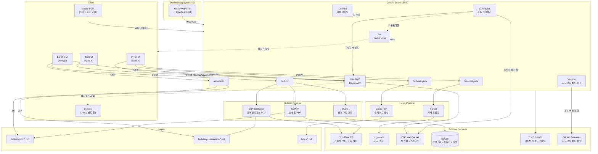

<div align="center">

# easyPreparation

**교회 주보 · 가사 PPT · 예배 화면 자동화 플랫폼**

[](https://go.dev)
[](https://nextjs.org)
[](https://www.typescriptlang.org)
[](https://pkg.go.dev/modernc.org/sqlite)
[](https://wails.io)
[](https://tailwindcss.com)
[](https://recoiljs.org)

[홈페이지](https://easy-preparation.vercel.app) · [다운로드](https://easy-preparation.vercel.app/download) · [요금제](https://easy-preparation.vercel.app/pricing) · [릴리즈](https://github.com/AwesomeYelim/easyPreparation/releases/latest)

</div>

---

## Architecture


```mermaid
flowchart TD
    subgraph Client["Client"]
        UI_B["Bulletin UI\n(Next.js)"]
        UI_L["Lyrics UI\n(Next.js)"]
        UI_BIBLE["Bible UI\n(Next.js)"]
        DISPLAY["Display\n(OBS / 별도 창)"]
        MOBILE["Mobile PWA\n(스마트폰 리모컨)"]
    end

    subgraph Desktop["Desktop App (Wails v2)"]
        WAILS["Wails WebView\n→ localhost:8080"]
    end

    subgraph Server["Go API Server :8080"]
        WS["/ws\nWebSocket"]
        SUB["/submit"]
        SUB_L["/submitLyrics"]
        SEARCH["/searchLyrics"]
        DL["/download"]
        DISP["/display/*\nDisplay API"]
        SCHED["Scheduler\n자동 스케줄러"]
        LICENSE["License\n기능 게이팅"]
        VERSION["Version\n자동 업데이트 체크"]
    end

    subgraph Bulletin["Bulletin Pipeline"]
        B_QUOTE["Quote\n성경 구절 조회"]
        B_PRINT["forPrint\n인쇄용 PDF"]
        B_PRES["forPresentation\n프레젠테이션 PDF"]
    end

    subgraph Lyrics["Lyrics Pipeline"]
        L_CRAWL["Parser\n가사 크롤링"]
        L_PDF["Lyrics PDF\n슬라이드 생성"]
    end

    subgraph Ext["External Services"]
        R2["Cloudflare R2\n찬송가 / 성시교독 PDF"]
        BUGS["bugs.co.kr\n가사 검색"]
        OBS["OBS WebSocket\n씬 전환 + 스트리밍"]
        SQLITE[("SQLite\n성경 DB + 찬송가 + 설정")]
        YOUTUBE["YouTube API\n라이브 방송 + 썸네일"]
        GITHUB["GitHub Releases\n자동 업데이트 체크"]
    end

    subgraph Output["output/"]
        OUT_BP["bulletin/print/*.pdf"]
        OUT_BPR["bulletin/presentation/*.pdf"]
        OUT_L["lyrics/*.pdf"]
    end

    UI_B -->|POST| SUB
    UI_L -->|POST| SUB_L
    UI_L -->|POST| SEARCH
    UI_B -->|GET| DL
    UI_B -->|POST /display/order| DISP
    UI_L -->|POST /display/append| DISP
    UI_BIBLE -->|POST /display/append| DISP
    MOBILE -->|WS + REST| Server
    WAILS -->|WebView| Server
    Server -->|progress| WS
    WS -.->|실시간 알림| Client
    DISP -.->|슬라이드 제어| DISPLAY
    SCHED -->|T-0 순서 로드| DISP
    SCHED -->|스트리밍 시작| OBS
    SCHED -.->|카운트다운| WS
    LICENSE -->|기능 차단 403| Server
    VERSION -->|최신 버전 조회| GITHUB

    SUB --> B_QUOTE
    B_QUOTE --> SQLITE
    SUB --> B_PRINT
    SUB --> B_PRES
    B_PRINT --> R2
    B_PRES --> R2
    B_PRINT --> OUT_BP
    B_PRES --> OUT_BPR
    SEARCH --> L_CRAWL
    L_CRAWL --> BUGS
    SUB_L --> L_PDF
    L_PDF --> OUT_L
    DL -->|ZIP| OUT_BP
    DL -->|ZIP| OUT_BPR
    DISP --> OBS
    Server --> YOUTUBE
```

---

## Features

| 기능 | 설명 | 플랜 |
|------|------|------|
| **주보 생성** | 인쇄용(A4) + 프레젠테이션용 PDF 자동 생성 | Free |
| **주보 편집** | 예배 순서 드래그 앤 드롭 재배치, 성경 구절 선택, 교회 소식 트리 편집 | Free |
| **가사 PPT 생성** | 곡명 입력 → 가사 자동 검색(bugs.co.kr) → 중복 제거 → ZIP 다운로드 | Free |
| **찬송가 검색** | DB 기반 645곡 새찬송가 번호/제목/가사 검색, Display 전송 | Free |
| **성경 검색** | 구약/신약 탭, 장/절 선택, 7개 번역판 지원, 비교 모드 (2컬럼) | Free |
| **예배 화면** | OBS Browser Source 연동, 성경/찬송/교독/가사 슬라이드 실시간 표시 | Free |
| **Display 통합 제어** | 주보/가사/성경 탭에서 append 방식으로 항목 추가, 제어판에서 삭제/점프/자동 넘김 | Free |
| **실시간 상태** | WebSocket으로 파일 생성 진행 상황 + Display 위치 브로드캐스트 | Free |
| **Desktop 앱** | Wails v2 기반 macOS .app — 서버 내장, 별도 설치 없이 실행 | Free |
| **모바일 PWA** | `/mobile` 엔드포인트 — 스마트폰으로 예배 슬라이드 next/prev 리모컨 제어 | Free |
| **초기 설정 위저드** | 첫 실행 시 SetupWizard — 교회명(한글/영문) 입력, NextAuth/소셜 로그인 없음 | Free |
| **자동 업데이트 알림** | GitHub Releases API 폴링 → 새 버전 발견 시 헤더 배너 표시 | Free |
| **라이선스 시스템** | Free / Pro / Enterprise 플랜, `middleware.FeatureGate`로 기능 게이팅 | — |
| **OBS 통합 제어** | 씬 전환 + 스트리밍 시작/종료 + 상태 모니터링, 수동 제어 지원 | Pro |
| **자동 스케줄러** | 예배 시간 자동 감지 → 카운트다운 → 순서 로드 → OBS 스트리밍 시작 | Pro |
| **YouTube 연동** | OAuth 인증 → 라이브 방송 자동 생성 → OBS 스트림 키 자동 설정 | Pro |
| **썸네일 자동 생성** | 예배 유형 + 날짜 기반 YouTube 썸네일 자동 생성 + 업로드 | Pro |
| **계정 설정** | 교회 정보 편집, 선호 성경 버전/테마/폰트 설정, 생성 이력 조회 | Free |

---

## 스크린샷

> 주보 편집 화면 — 예배 순서 선택 → 항목 편집 → 미리보기

```
┌────────┬──────────────────────────────────────────────┐
│        │  TopHeader                         [교회명]  │
│  Left  ├──────────────┬────────────┬─────────────────┤
│  Side  │  예배 순서   │ 선택 순서  │  생성된 내용    │
│  bar   │  선택하기    │            │                 │
│        │  ──────────  │ [전주]     │  전주           │
│ [주보] │  [전주]      │ [예배부름] │  예배의 부름    │
│ [찬양] │  [예배부름]  │ [찬송]     │  찬송  27장     │
│ [성경] │  [찬송]      │ [교독] ... │  성시교독 31편  │
│        │  [성경봉독]  │ ────────── │  ...            │
│ [설정] │  ...         │ [상세편집] │                 │
└────────┴──────────────┴────────────┴─────────────────┘
```

---

## OBS 통합 아키텍처

easyPreparation은 **콘텐츠 · 타이밍 · 제어**를 담당하고, OBS는 **인코딩 · 합성 · 송출**만 담당합니다.

```
┌─ easyPreparation (두뇌) ─────────────────┐      ┌─ OBS Studio (근육) ──────────┐
│                                           │      │                              │
│  스케줄러                                 │      │                              │
│  ├─ 예배 시간 자동 감지                   │      │                              │
│  ├─ T-N분: 카운트다운 시작          ──────┼──ws──┼→ 씬 전환                     │
│  └─ T-0초: 순서 로드 + 스트리밍     ──────┼──ws──┼→ 스트리밍 시작/종료          │
│                                           │      │                              │
│  Display 렌더링                           │      │   ┌──────────────────────┐   │
│  ├─ /display (프로젝터용)           ◀─────┼──────┼── │ Browser Source #1    │   │
│  ├─ /display/overlay (방송 자막)    ◀─────┼──────┼── │ Browser Source #2    │   │
│  └─ 카운트다운 오버레이                   │      │   └──────────────────────┘   │
│                                           │      │                              │
│  제어판                                   │      │   카메라 입력                │
│  ├─ 항목 점프 / 드래그 재배치             │      │   오디오 믹싱                │
│  ├─ LIVE 뱃지 + 수동 방송 시작/종료       │      │   씬 합성 + 트랜지션         │
│  └─ 카운트다운 배너                       │      │   RTMP 인코딩 + 송출         │
│                                           │      │                              │
└───────────────────────────────────────────┘      └──────────────────────────────┘
          │                                                     │
          │              WebSocket (goobs)                       │
          └─────────────────────────────────────────────────────┘
```

**왜 OBS 의존인가?**

| 자체 구현 시 | OBS 활용 시 |
|-------------|-------------|
| RTMP 인코딩, 오디오 믹싱, 하드웨어 가속 직접 구현 | 10년+ 검증된 인코딩 파이프라인 |
| 카메라 입력 + 마이크 + 화면 합성 = 수개월 작업 | 이미 완성된 씬 합성 시스템 |
| 안정성 보장 어려움 (실시간 방송) | 전 세계 방송에서 검증됨 |

easyPreparation은 **예배 자동화 플랫폼**에 집중하고, 방송 인프라는 OBS에 위임합니다.

### 스케줄 자동화 흐름


```mermaid
sequenceDiagram
    participant S as 스케줄러
    participant D as Display / Overlay
    participant C as 제어판
    participant O as OBS

    Note over S: 예배 시간 N분 전
    loop 매초 카운트다운
        S->>D: schedule_countdown (WS)
        S->>C: schedule_countdown (WS)
        D-->>D: 카운트다운 오버레이 표시
        C-->>C: 빨간 배너 MM:SS
    end

    Note over S: 예배 시간 도달 (T-0)
    S->>S: config/{worshipType}.json 로드
    S->>D: order (WS) — 예배 순서 교체
    S->>O: StartStream (goobs)
    S->>O: SwitchScene (goobs)
    S->>C: schedule_started (WS)
    D-->>D: 카운트다운 해제 → 첫 슬라이드
    C-->>C: 카운트다운 해제 → LIVE 뱃지
```

### OBS 권장 설정

| Source | URL | 용도 |
|--------|-----|------|
| Browser Source #1 | `http://localhost:8080/display` | 프로젝터 출력 (악보 이미지 포함) |
| Browser Source #2 | `http://localhost:8080/display/overlay` | 방송 자막 (반투명 배경, 가사/성경) |

---

## Project Structure

```
easyPreparation/
├── cmd/
│   ├── server/              # Go 서버 진입점 (:8080)
│   │   ├── main.go
│   │   ├── embed_dev.go     # //go:build dev  → getFrontendFS() = nil
│   │   └── embed_prod.go    # //go:build !dev → embed.FS (ui/out)
│   ├── desktop/             # Wails v2 Desktop 앱 진입점
│   │   ├── main.go          # Wails App + HTTP 서버 내장
│   │   ├── embed_dev.go
│   │   └── embed_prod.go
│   └── extractMusic/        # 악보 선 검출 실험 도구 (standalone)
│
├── internal/                # Go 백엔드 패키지
│   ├── api/                 # HTTP 라우터 (StartServer, StopServer)
│   ├── app/                 # 공통 초기화 로직 (DB, OBS, YouTube, 스케줄러)
│   ├── bulletin/            # 주보 PDF 생성
│   │   ├── forPresentation/
│   │   └── forPrint/
│   ├── handlers/            # HTTP + WebSocket + Display + 스케줄러 핸들러
│   ├── license/             # 라이선스 매니저 (Plan/Feature/오프라인 캐시)
│   │   ├── types.go         # Plan/Feature 상수, PlanFeatures 맵
│   │   ├── manager.go       # 싱글턴 (DB + 파일 캐시 이중 저장)
│   │   ├── offline.go       # data/license.json 캐시, 디바이스 ID
│   │   └── keygen.go        # 라이선스 키 서명 검증
│   ├── lyrics/              # 가사 PDF 생성
│   ├── middleware/          # CORS + FeatureGate 미들웨어
│   ├── obs/                 # OBS WebSocket 매니저 (goobs, 자동 재연결)
│   ├── path/                # 실행 파일 기준 경로 해석
│   ├── presentation/        # gofpdf PDF 렌더러 (NFC 정규화)
│   ├── quote/               # 성경 구절 DB 조회 (SQLite, 다중 버전)
│   ├── selfupdate/          # GitHub Releases API 업데이트 체커
│   ├── thumbnail/           # YouTube 썸네일 생성
│   ├── types/               # 공유 타입
│   ├── utils/               # 유틸리티 (zip, 문자열, 디렉토리)
│   ├── version/             # 버전 싱글턴 (ldflags 주입)
│   ├── assets/              # PDF 에셋 다운로더 (Cloudflare R2 + 로컬 캐시)
│   ├── googleCloud/         # Google Drive 연동 (deprecated)
│   └── youtube/             # YouTube OAuth + 라이브 방송 + 썸네일 업로드
│
├── ui/                      # Next.js 프론트엔드 (Tailwind CSS v3)
│   ├── tailwind.config.ts   # Stitch 디자인 토큰
│   ├── postcss.config.mjs   # Tailwind PostCSS
│   └── app/
│       ├── globals.css      # Tailwind directives + Inter 폰트 + CSS 변수
│       ├── bulletin/        # 주보 편집 페이지
│       │   ├── page.tsx
│       │   └── components/
│       │       ├── WorshipOrder.tsx
│       │       ├── SelectedOrder.tsx
│       │       ├── Detail.tsx
│       │       ├── BibleSelect.tsx
│       │       ├── ChurchNews.tsx
│       │       ├── EditChildNews.tsx
│       │       ├── ResultPage.tsx
│       │       └── DisplayControlPanel.tsx
│       ├── lyrics/          # 가사 PPT 생성 + 찬송가 검색
│       │   └── components/
│       │       ├── LyricsManager.tsx
│       │       └── HymnSearch.tsx
│       ├── bible/           # 성경 검색 (7개 번역판, 비교 모드)
│       ├── components/      # 전역 컴포넌트
│       │   ├── AppShell.tsx         # CSS Grid 루트 레이아웃
│       │   ├── LeftSidebar.tsx      # 좌측 수직 네비게이션
│       │   ├── TopHeader.tsx        # 상단 페이지 헤더
│       │   ├── SideBar.tsx          # 설정 슬라이드 오버
│       │   ├── SetupWizard.tsx      # 첫 실행 교회 정보 입력
│       │   ├── ConfirmModal.tsx     # 공용 확인/경고 모달
│       │   ├── SchedulePanel.tsx    # 스케줄 설정 모달
│       │   ├── SettingsPanel.tsx    # 사용자 설정 모달
│       │   ├── HistoryList.tsx      # 생성 이력 모달
│       │   ├── LicensePanel.tsx     # 라이선스 키 입력 + 상태
│       │   ├── FeatureGate.tsx      # Pro 전용 UI 래퍼 (잠금 오버레이)
│       │   ├── YouTubePanel.tsx     # YouTube 연동 + 방송 생성
│       │   ├── OBSSourcePanel.tsx   # OBS 소스 관리
│       │   ├── TemplatePanel.tsx    # 예배 템플릿 관리
│       │   └── UpdateChecker.tsx    # 자동 업데이트 배너
│       ├── lib/
│       │   ├── apiClient.ts         # Go 서버 API 호출 중앙화
│       │   ├── LocalAuthContext.tsx # 로컬 인증 Context (SetupWizard 연동)
│       │   ├── LicenseContext.tsx   # 라이선스 상태 전역 Context
│       │   ├── bibleUtils.ts
│       │   ├── treeUtils.ts
│       │   └── wsClient.ts
│       ├── types/
│       └── recoilState.ts
│
├── landing/                 # 홍보 랜딩 페이지 (Next.js 14, Vercel 배포)
├── workers/license-api/     # CF Workers 라이선스+에셋 서버 (Hono+토스페이먼츠+R2)
├── craw/                    # 성경 크롤러 (GoodTV API → SQLite, 7개 번역판)
├── migrations/              # SQL 마이그레이션 (001~004)
├── tools/                   # Python AI 툴킷
├── config/                  # 설정 파일 (gitignore)
├── data/                    # SQLite DB, PDF/PNG 캐시, 상태 파일
│   ├── schema.sql           # 자동 초기화 스키마 (서버 시작 시 적용)
│   ├── display_state.json   # Display 상태 영속화
│   ├── schedule.json        # 스케줄 설정 영속화
│   └── license.json         # 라이선스 캐시 (권한 0600)
├── output/                  # 생성된 PDF 출력
├── public/font/             # 로컬 캐시 폰트 (.ttf)
└── Makefile
```

---

## 프론트엔드 아키텍처

### 레이아웃 & Provider 계층

```
RecoilProvider
  └─ LocalAuthProvider        (교회 설정 상태, SetupWizard 트리거)
       └─ LicenseProvider     (라이선스 플랜, FeatureGate)
            └─ WebSocketProvider
                 └─ AppShell (CSS Grid)
                      ├─ LeftSidebar (좌측 네비)
                      ├─ TopHeader (상단 헤더)
                      ├─ { children }
                      └─ GlobalDisplayPanel (조건부)
```

### 스타일링: Tailwind CSS v3 (Stitch 디자인 시스템)

- **폰트**: Inter (Google Fonts) + Material Symbols Outlined
- **액센트**: electric-blue `#3B82F6`
- **카드**: `bg-white rounded-2xl border-slate-100 shadow-sm`
- **레이아웃**: 좌측 사이드바(w-64) + 상단 헤더 + 메인 콘텐츠

### 전역 상태 (Recoil)

```ts
worshipOrderState      // Record<WorshipType, WorshipOrderItem[]>  예배 순서 전체
selectedDetailState    // WorshipOrderItem                         현재 편집 항목
userInfoState          // UserChurchInfo                           교회 정보
userSettingsState      // UserSettings                             선호 설정
displayPanelOpenState  // boolean                                  제어판 열림 여부
displayItemsState      // WorshipOrderItem[]                       Display 항목 목록
lyricsSongsState       // LyricsSong[]                            가사 곡 목록
```

### 공유 유틸

```ts
// app/lib/apiClient.ts
apiClient.startDisplay(items)             // POST {GO}/display/order  (전체 교체)
apiClient.appendToDisplay(items)          // POST {GO}/display/append (추가)
apiClient.removeFromDisplay(index)        // POST {GO}/display/remove (삭제)
apiClient.jumpDisplay(index, subPage?)    // POST {GO}/display/jump
apiClient.navigateDisplay(direction)      // POST {GO}/display/navigate
apiClient.getDisplayStatus()              // GET  {GO}/display/status
apiClient.getSchedule()                   // GET  {GO}/api/schedule
apiClient.saveSchedule(config)            // POST {GO}/api/schedule
apiClient.scheduleTest(action, type)      // POST {GO}/api/schedule/test
apiClient.streamControl(action)           // POST {GO}/api/schedule/stream
openDisplayWindow()                       // Display 창 열기 (중복 reload 방지)
```

---

## Getting Started

### Prerequisites

```shell
# Go 1.23+
# Node.js 22+ (npm)
# Ghostscript (PDF → PNG 변환)

# macOS
brew install ghostscript

# Ubuntu / Debian
apt install ghostscript
```

### Configuration

`config/` 디렉토리에 설정 파일 배치 (git 미포함):

| 파일 | 용도 | 필수 |
|------|------|------|
| `db.json` | SQLite DSN (없으면 자동 생성 `data/ep.db`) | 선택 |
| `auth.json` | Google Drive 서비스 계정 키 (deprecated — R2 전환) | 불필요 |
| `google_oauth.json` | YouTube OAuth Client ID/Secret | 선택 (Pro) |
| `obs.json` | OBS WebSocket 씬 매핑 (없으면 OBS 비활성) | 선택 (Pro) |
| `custom.json` | PDF 크기 / 폰트 / 색상 설정 | 선택 |

**SQLite 자동 초기화**: `config/db.json`이 없어도 서버 시작 시 `data/ep.db`에 `data/schema.sql`을 자동 적용합니다. PostgreSQL 없이도 바로 실행 가능합니다.

### 환경변수 (선택)

```env
# ui/.env.local (선택 — 기본값: http://localhost:8080)
NEXT_PUBLIC_API_BASE_URL=http://localhost:8080
```

NextAuth, DATABASE_URL, GOOGLE_CLIENT_ID/SECRET 환경변수는 더 이상 필요하지 않습니다.

### Run

```shell
# 개발 (Go + Next.js 동시)
make dev

# 또는 개별 실행
go run -tags dev ./cmd/server/    # Go 서버 :8080
cd ui && npm install && npm run dev   # Next.js :3000

# 프로덕션 빌드 (Next.js static export → Go embed)
make build
# 결과물: bin/server (단독 실행 파일, 프론트엔드 내장)

# Desktop 앱 빌드 (macOS — Wails v2)
make build-desktop
# 결과물: cmd/desktop/build/bin/easyPreparation.app

# Desktop 개발 모드
make dev-desktop
```

---

## API Endpoints

서버는 `0.0.0.0:8080`에서 실행됩니다.

### 핵심 API

| Method | Path | 설명 |
|--------|------|------|
| `WS` | `/ws` | WebSocket (진행 상황 + Display 제어 + 카운트다운) |
| `POST` | `/submit` | 주보 생성 요청 |
| `POST` | `/submitLyrics` | 가사 PDF 생성 → ZIP 응답 |
| `POST` | `/searchLyrics` | 가사 검색 (bugs.co.kr) |
| `GET` | `/download?target=<name>` | 주보 PDF ZIP 다운로드 |

### Display API

| Method | Path | 설명 |
|--------|------|------|
| `GET` | `/display` | 예배 슬라이드 HTML (프로젝터용) |
| `GET` | `/display/overlay` | 텍스트 오버레이 HTML (방송용, 반투명 배경) |
| `POST` | `/display/order` | 예배 순서 전송 — 전체 교체 (전처리 포함) |
| `POST` | `/display/append` | 항목 추가 |
| `POST` | `/display/remove` | 항목 삭제 (인덱스 기반) |
| `POST` | `/display/reorder` | 드래그 앤 드롭 순서 변경 (`{from, to}`) |
| `POST` | `/display/church-name` | 교회명 업데이트 |
| `POST` | `/display/navigate` | 슬라이드 이동 (next/prev) |
| `POST` | `/display/jump` | 특정 항목으로 점프 (subPageIdx 지원) |
| `POST` | `/display/timer` | 자동 넘김 타이머 제어 |
| `GET` | `/display/status` | 현재 상태 (items, idx, OBS, stream) |

### 성경 + 찬송가 API

| Method | Path | 설명 |
|--------|------|------|
| `GET` | `/api/bible/books` | 성경 구조 (책/장/절) |
| `GET` | `/api/bible/versions` | 성경 번역본 목록 |
| `GET` | `/api/bible/verses` | 성경 구절 조회 |
| `GET` | `/api/bible/search` | 성경 구절 검색 |
| `GET` | `/api/hymns` | 찬송가 목록 (페이징) |
| `GET` | `/api/hymns/search` | 찬송가 검색 (번호/제목/가사) |
| `GET` | `/api/hymns/detail` | 찬송가 상세 (가사 포함) |

### 설정 + 사용자 API

| Method | Path | 설명 |
|--------|------|------|
| `GET` | `/api/setup/status` | 초기 설정 여부 (`{needsSetup, church}`) |
| `POST` | `/api/setup` | 교회 정보 저장 (`{name, englishName}`) |
| `GET/POST` | `/api/user` | 교회/사용자 정보 조회/수정 |
| `GET/PUT` | `/api/settings` | 사용자 설정 조회/저장 |
| `GET` | `/api/history` | 생성 이력 조회 |
| `GET/POST` | `/api/worship-order` | 예배 순서 조회/저장 |
| `GET` | `/api/worship-order/list` | 예배 유형 목록 |

### 라이선스 API

| Method | Path | 설명 |
|--------|------|------|
| `GET` | `/api/license` | 현재 라이선스 상태 (plan, deviceId, daysUntilExpiry) |
| `POST` | `/api/license/activate` | 라이선스 키 활성화 — `{licenseKey}` |
| `POST` | `/api/license/deactivate` | 라이선스 비활성화 (Free 복귀) |
| `POST` | `/api/license/verify` | 서버 측 라이선스 재검증 |

### 스케줄러 API (Pro)

| Method | Path | 설명 |
|--------|------|------|
| `GET/POST` | `/api/schedule` | 스케줄 설정 조회/저장 |
| `POST` | `/api/schedule/test` | 테스트 — `{action: "countdown"\|"trigger", worshipType}` |
| `POST` | `/api/schedule/stream` | OBS 스트리밍 수동 제어 — `{action: "start"\|"stop"\|"status"}` |

### 버전 + 업데이트 API

| Method | Path | 설명 |
|--------|------|------|
| `GET` | `/api/version` | `{version, commit, buildTime}` |
| `GET` | `/api/update/check` | GitHub Releases 비교 → `{hasUpdate, latest, current, url}` |

### YouTube API (Pro)

| Method | Path | 설명 |
|--------|------|------|
| `GET` | `/api/youtube/auth` | OAuth 동의 화면으로 리디렉트 |
| `GET` | `/api/youtube/callback` | OAuth 콜백 처리 + 토큰 저장 |
| `GET` | `/api/youtube/status` | 연결 상태 + 방송/스트림 목록 |
| `POST` | `/api/youtube/setup-obs` | 방송 생성 + 스트림 키 → OBS 자동 설정 + 썸네일 업로드 |

### 썸네일 API (Pro)

| Method | Path | 설명 |
|--------|------|------|
| `POST` | `/api/thumbnail/generate` | 썸네일 생성 (Pro) |
| `GET` | `/api/thumbnail/preview` | 썸네일 미리보기 |
| `GET/POST` | `/api/thumbnail/config` | 썸네일 설정 조회/저장 |
| `POST` | `/api/thumbnail/upload` | YouTube 업로드 (Pro) |
| `GET` | `/api/thumbnail/image` | 생성된 이미지 서빙 |

### 모바일 PWA

| Method | Path | 설명 |
|--------|------|------|
| `GET` | `/mobile` | 예배 슬라이드 리모컨 HTML (PWA) |
| `GET` | `/mobile/manifest.json` | PWA 설치 메타데이터 |
| `GET` | `/mobile/sw.js` | Service Worker (오프라인 캐시) |
| `GET` | `/mobile/qr.png` | QR 코드 PNG (로컬 IP 자동 감지) |

---

## 라이선스 시스템

### 플랜별 기능

| 기능 | Free | Pro | Enterprise |
|------|------|-----|------------|
| 주보/가사 PDF 생성 | V | V | V |
| 성경/찬송가 검색 | V | V | V |
| 예배 화면 (Display) | V | V | V |
| Desktop 앱 | V | V | V |
| 모바일 PWA 리모컨 | V | V | V |
| OBS 씬 전환 + 스트리밍 | | V | V |
| 자동 스케줄러 | | V | V |
| YouTube 라이브 연동 | | V | V |
| 썸네일 자동 생성/업로드 | | V | V |
| 다중 예배 유형 | | V | V |
| 클라우드 백업 | | | V |

### 기능 게이팅

```go
// server.go — Pro 기능에 FeatureGate 미들웨어 적용
mux.Handle("/api/schedule", middleware.FeatureGate(license.FeatureAutoScheduler, handlers.ScheduleHandler))
```

기능이 잠긴 경우 HTTP 403 응답:
```json
{"error": "feature_locked", "feature": "auto_scheduler", "plan": "free", "message": "이 기능은 Pro 플랜에서 사용할 수 있습니다."}
```

### 라이선스 활성화

1. 제어판 → 라이선스 아이콘 → `LicensePanel` 모달
2. 라이선스 키 입력 → `POST /api/license/activate`
3. 키 서명 검증 통과 시 Pro 활성화
4. 활성화 정보는 `data/license.json`에 캐시 (DB 없는 환경도 유지)

---

## CI/CD + 릴리즈

### GitHub Actions 워크플로우

| 파일 | 트리거 | 동작 |
|------|--------|------|
| `.github/workflows/release.yml` | `v*` 태그 push | Server 4플랫폼 + Desktop 3플랫폼 빌드 → GitHub Release |
| `.github/workflows/test.yml` | Pull Request | `go vet` + `go build` 빠른 검증 |
| `.github/workflows/landing.yml` | `landing/` 변경 PR | 랜딩 페이지 빌드 검증 |

### 빌드 아티팩트 (release.yml)

| 아티팩트 | 플랫폼 | 타입 |
|----------|--------|------|
| `easyPreparation_desktop_darwin_arm64.zip` | macOS ARM | Desktop (.app) |
| `easyPreparation_desktop_windows_amd64_setup.exe` | Windows | Desktop |
| `easyPreparation_desktop_linux_amd64` | Linux | Desktop |
| `easyPreparation_server_darwin_arm64` | macOS ARM | Server |
| `easyPreparation_server_darwin_amd64` | macOS Intel | Server |
| `easyPreparation_server_linux_amd64` | Linux | Server |
| `easyPreparation_server_windows_amd64.exe` | Windows | Server |
| `checksums.txt` | — | SHA256 체크섬 |

파이프라인: `build-frontend`(1회) → `build-server`(4플랫폼) + `build-desktop`(3플랫폼) → `release`

### 릴리즈 절차

```bash
# 변경사항 커밋 + push
git add -p && git commit -m "feat: ..." && git push

# 태그 생성 + push → GitHub Actions 자동 빌드 + Release 생성
git tag v1.2.0 && git push origin v1.2.0
```

### 빌드 태그 분리 (embed)

| 파일 | 빌드 태그 | 동작 |
|------|-----------|------|
| `cmd/server/embed_dev.go` | `//go:build dev` | `getFrontendFS()` → `nil` (Next.js dev server) |
| `cmd/server/embed_prod.go` | `//go:build !dev` | `//go:embed all:frontend` → 정적 파일 서빙 |

---

## Desktop 앱 (Wails v2)

### 아키텍처

```
easyPreparation.app
└─ Wails WebView
   └─ http://localhost:8080  ←→  Go HTTP 서버 (내장)
                                  └─ cmd/desktop/main.go
                                     └─ internal/api/server.go (동일 라우터)
```

- **진입점**: `cmd/desktop/main.go`
- Wails WebView는 내장 asset server 대신 `http://localhost:8080`을 직접 로드
- `startup()` — DB/OBS/YouTube/스케줄러 초기화 → HTTP 서버 시작 → 준비 완료 후 `WindowShow`
- `shutdown()` — HTTP graceful shutdown (5초) → 스케줄러 중지 → OBS/DB 닫기

### macOS 빌드 (필수 CGO_LDFLAGS)

```bash
CGO_LDFLAGS="-framework UniformTypeIdentifiers" wails build -o easyPreparation
```

---

## 모바일 PWA 리모컨

```
같은 WiFi에서 접속:  http://{로컬IP}:8080/mobile
QR 코드:            http://{로컬IP}:8080/mobile/qr.png
```

제어판 UI에서 QR 아이콘 클릭 → QR 이미지 표시 → 스마트폰으로 스캔 → 예배 슬라이드 next/prev 제어

iOS/Android Chrome에서 홈 화면에 추가하면 전체화면 앱으로 실행됩니다.

---

## data.info Field Reference

예배 순서 JSON의 `info` 필드 값 규칙:

| 값 | 설명 | Detail 컴포넌트 동작 |
|----|------|---------------------|
| `"c_edit"` | 찬송번호/제목 편집 | textarea + lead input |
| `"b_edit"` | 성경 구절 편집 | BibleSelect + lead input |
| `"edit"` | 자유 텍스트 편집 | textarea + lead input |
| `"r_edit"` | lead만 편집 (obj 자동) | lead input only |
| `"notice"` | 교회 소식 블록 | ChurchNews UI |
| `"-"` | 자동 처리 (편집 불가) | "이 항목은 자동으로 처리됩니다" |

---

## DB 테이블

| 테이블 | 설명 |
|--------|------|
| `bible_versions` | 성경 번역판 목록 (7개) |
| `books` | 성경 책 정보 |
| `verses` | 성경 구절 (버전별 약 31,000절) |
| `hymns` | 찬송가 (645곡 새찬송가 메타데이터) |
| `churches` | 교회 정보 (name, english_name, email) |
| `user_settings` | 선호 버전, 테마, 폰트, BPM |
| `generation_history` | 생성 이력 + 예배 순서 데이터 (order_data) |
| `licenses` | 라이선스 정보 (plan, device_id, expires_at, signature) |

**DB 엔진**: SQLite (`modernc.org/sqlite`, CGO 불필요). `data/schema.sql` 기반 자동 초기화.

---

## 성경 번역판

| ID | 이름 | 비고 |
|----|------|------|
| 1 | 개역개정 | 기본값 |
| 2 | 개역한글 | |
| 3 | 공동번역 | |
| 4 | 표준새번역 | |
| 5 | NIV | 영문 |
| 6 | KJV | 영문 |
| 7 | 우리말성경 | |

비교 모드: Bible 페이지에서 두 번역판을 나란히 비교 가능.

---

## External Resources

| 리소스 | 용도 |
|--------|------|
| **Cloudflare R2** | 찬송가 악보 PDF / 성시교독 PDF (CDN 캐시) |
| **SQLite** | 성경 구절 DB (7개 번역판), 찬송가 DB, 사용자 설정/이력, 라이선스 |
| **OBS WebSocket** | 방송 씬 전환 + 스트리밍 시작/종료 + 상태 모니터링 (goobs) |
| **YouTube Data API v3** | 라이브 방송 생성/관리, 썸네일 업로드 (OAuth 2.0) |
| **GitHub Releases API** | 자동 업데이트 체크 (`AwesomeYelim/easyPreparation`) |
| **bugs.co.kr** | 가사 검색 크롤링 |

---

## PDF Size Reference

```
# 16:9
  width : 1409.0,  height : 792.5
  inner — width : 1270,  height : 530

# 16:10
  width : 1409.0,  height : 880.6
  inner — width : 1270,  height : 590

# A4 (주보 인쇄용)
  width : 1409.0,  height : 996.0

※ mac 환경은 항상 16:10 비율을 따릅니다.
```
