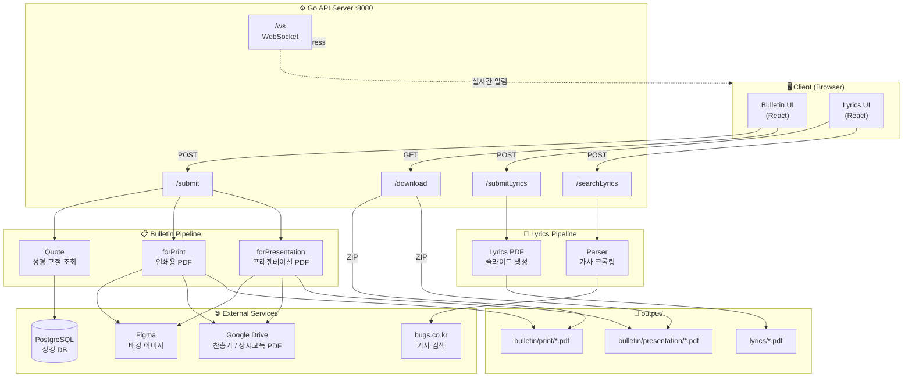

# easyPreparation

> A server-side automation tool for weekly worship preparation — generates bulletin PDFs and lyrics presentation PDFs.

---

## Architecture


```mermaid
flowchart TD
    subgraph Client["🖥️ Client (Browser)"]
        UI_B["Bulletin UI\n(React)"]
        UI_L["Lyrics UI\n(React)"]
    end

    subgraph Server["⚙️ Go API Server :8080"]
        WS["/ws\nWebSocket"]
        SUB["/submit"]
        SUB_L["/submitLyrics"]
        SEARCH["/searchLyrics"]
        DL["/download"]
    end

    subgraph Bulletin["📋 Bulletin Pipeline"]
        B_QUOTE["Quote\n성경 구절 조회"]
        B_PRINT["forPrint\n인쇄용 PDF"]
        B_PRES["forPresentation\n프레젠테이션 PDF"]
    end

    subgraph Lyrics["🎵 Lyrics Pipeline"]
        L_CRAWL["Parser\n가사 크롤링"]
        L_PDF["Lyrics PDF\n슬라이드 생성"]
    end

    subgraph Ext["🌐 External Services"]
        FIGMA["Figma\n배경 이미지"]
        GCLOUD["Google Drive\n찬송가 / 성시교독 PDF"]
        BUGS["bugs.co.kr\n가사 검색"]
        PG[("PostgreSQL\n성경 DB")]
    end

    subgraph Output["📁 output/"]
        OUT_BP["bulletin/print/*.pdf"]
        OUT_BPR["bulletin/presentation/*.pdf"]
        OUT_L["lyrics/*.pdf"]
    end

    UI_B -->|POST| SUB
    UI_L -->|POST| SUB_L
    UI_L -->|POST| SEARCH
    UI_B -->|GET| DL
    Server -->|progress| WS
    WS -.->|실시간 알림| Client

    SUB --> B_QUOTE
    B_QUOTE --> PG
    SUB --> B_PRINT
    SUB --> B_PRES

    B_PRINT --> FIGMA
    B_PRES --> FIGMA
    B_PRINT --> GCLOUD
    B_PRES --> GCLOUD

    B_PRINT --> OUT_BP
    B_PRES --> OUT_BPR

    SEARCH --> L_CRAWL
    L_CRAWL --> BUGS
    SUB_L --> L_PDF
    L_PDF --> OUT_L

    DL -->|ZIP| OUT_BP
    DL -->|ZIP| OUT_BPR
```

---

## Features

| 기능 | 설명 |
|------|------|
| **주보 생성** | Figma 디자인 기반 인쇄용(A4) + 프레젠테이션용 PDF 자동 생성 |
| **가사 PDF 생성** | 찬양 가사를 슬라이드 형태의 PDF로 변환 |
| **가사 검색** | bugs.co.kr 크롤링으로 가사 자동 검색 |
| **WebSocket** | 실시간 진행 상황 브로드캐스트 |

---

## Project Structure

```
easyPreparation/
├── cmd/
│   ├── server/         # 메인 서버 진입점
│   │   └── main.go
│   └── extractMusic/   # 악보 선 검출 실험 도구 (standalone)
│       └── main.go
│
├── internal/
│   ├── api/            # HTTP 서버 라우터
│   ├── bulletin/       # 주보 PDF 생성 로직
│   │   ├── bulletin.go
│   │   ├── define/     # 공유 타입 (PdfInfo)
│   │   ├── forPresentation/
│   │   └── forPrint/
│   ├── classification/ # 분류 타입 정의
│   ├── colorPalette/   # 이미지 색상 추출
│   ├── date/           # 날짜 유틸
│   ├── db/             # BoltDB 관련
│   ├── extract/        # config/custom.json 파싱
│   ├── figma/          # Figma API 연동
│   ├── font/           # 웹 폰트 다운로드
│   ├── format/         # 텍스트 포맷
│   ├── googleCloud/    # Google Drive 연동
│   ├── gui/            # Lorca 기반 GUI
│   ├── handlers/       # HTTP 핸들러
│   ├── lyrics/         # 가사 PDF 생성 로직
│   │   └── lyricsPDF.go
│   ├── middleware/     # CORS 미들웨어
│   ├── parser/         # 가사 파싱 / 크롤링
│   ├── path/           # 실행 경로 유틸
│   ├── presentation/   # gofpdf 기반 PDF 렌더러
│   ├── quote/          # 성경 구절 DB 조회
│   ├── sanitize/       # 파일명 정규화
│   ├── server/         # 정적 파일 서버 (GUI용)
│   ├── sorted/         # 파일 정렬 유틸
│   ├── types/          # 공용 타입 (DataEnvelope)
│   └── utils/          # 공용 유틸 (zip, 문자열, 디렉토리)
│
├── ui/
│   ├── bulletin/       # 주보 입력 프론트엔드 (React)
│   └── lyrics/         # 가사 입력 프론트엔드 (React)
│
├── config/
│   ├── custom.json     # PDF 크기 / 폰트 / 색상 설정
│   ├── auth.json       # Google Cloud 서비스 계정 키 (⚠️ git 제외)
│   └── *.json          # 예배 순서 데이터 (target별 생성)
│
├── output/
│   ├── bulletin/
│   │   ├── print/      # 인쇄용 주보 PDF 출력
│   │   └── presentation/ # 프레젠테이션용 주보 PDF 출력
│   └── lyrics/         # 가사 PDF 출력
│
├── public/
│   └── font/           # 로컬 캐시 폰트 (.ttf)
│
├── bin/                # 크로스 컴파일 바이너리
├── data/               # BoltDB 로컬 데이터
├── craw/               # 크롤러 도구
├── autoBuild.sh        # 멀티 플랫폼 빌드 스크립트
└── build.sh            # 현재 플랫폼 단일 빌드 스크립트
```

---

## API Endpoints

서버는 `0.0.0.0:8080` 에서 실행됩니다.

| Method | Path | 설명 |
|--------|------|------|
| `GET` | `/ws` | WebSocket 연결 (진행 상황 수신) |
| `POST` | `/submit` | 주보 생성 요청 |
| `POST` | `/submitLyrics` | 가사 PDF 생성 요청 → ZIP 응답 |
| `POST` | `/searchLyrics` | 가사 검색 (bugs.co.kr) |
| `GET` | `/download?target=<name>` | 주보 PDF ZIP 다운로드 |

---

## Getting Started

### 1. Prerequisites

```shell
# LibreOffice + Ghostscript (PDF → PNG 변환에 사용)
apt update && apt install libreoffice ghostscript

# macOS symbolic link (필요한 경우)
ln -s /Applications/LibreOffice.app/Contents/MacOS/soffice /usr/local/bin/libreoffice
```

### 2. Configuration

`config/custom.json` 에서 PDF 크기, 폰트, 색상을 설정합니다.

```json
{
  "classification": {
    "bulletin": {
      "print":        { "width": 1409.0, "height": 996.0,  "fontSize": 50,  ... },
      "presentation": { "width": 1409.0, "height": 792.5,  "fontSize": 100, ... }
    },
    "lyrics": {
      "presentation": { "width": 1409.0, "height": 792.5,  "fontSize": 170, ... }
    }
  },
  "outputPath": {
    "bulletin": "output/bulletin",
    "lyrics":   "output/lyrics"
  }
}
```

`config/auth.json` 에 Google Cloud 서비스 계정 키를 위치시킵니다 (git 미포함).

### 3. Run

```shell
# 개발 실행
go run ./cmd/server/.

# 로컬 단일 빌드
go build -o ./bin/main ./cmd/server/.

# 멀티 플랫폼 빌드 (linux/amd64, darwin/arm64, windows/amd64)
bash autoBuild.sh
```

빌드된 바이너리는 `bin/` 폴더에 생성됩니다.

```
bin/main_darwin_arm64
bin/main_linux_amd64
bin/main_windows_amd64.exe
```

---

## PDF Size Reference

```
# 16:9
  width : 1409.0,  height : 792.5
  inner — width : 1270,  height : 530

# 16:10
  width : 1409.0,  height : 880.6
  inner — width : 1270,  height : 590

# A4 (주보 인쇄용)
  width : 1409.0,  height : 996.0

※ mac 환경은 항상 16:10 비율을 따릅니다.
```

---

## External Resources

| 리소스 | 용도 |
|--------|------|
| **Figma** | 주보 인쇄용 배경 이미지(PNG) / 프레젠테이션 템플릿(PNG) |
| **Google Drive** | 찬송가 악보 PDF / 성시교독 PDF |
| **GitHub Gist** | 웹 폰트 목록 JSON (NanumGothic, Jacques François 등) |
| **PostgreSQL** | 성경 구절 DB |

---

## data.info Field Reference

예배 순서 JSON의 `info` 필드 값 규칙입니다.

| 값 | 설명 |
|----|------|
| `"-"` | 수정 없음 |
| `"b_edit"` | 성경 구절 연동 (Bible edit) |
| `"c_edit"` | 중앙 정보 수정 (Center obj edit) |
| `"r_edit"` | 우측 정보 수정 (Lead edit) |
| `"notice"` | 교회 소식 블록 |
