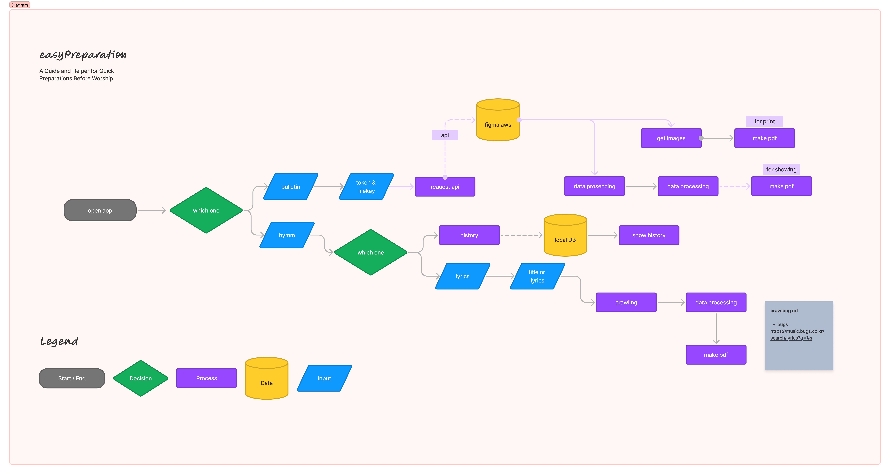

# easyPreparation

## A Guide and Helper for Quick Preparations Before Worship

## 1. Automatic PPT Generation Program for Praise Titles and Lyrics
* Required Elements:
    - Church-specific background image

## 2. Easy Bulletin Creation Program (Incomplete)
* Required Elements:
    - Church-specific cover image
    - Bulletin content, etc.



## 3. Before Start

  ```shell
  apt update && apt install libreoffice && apt install Ghostscript
   # if this is not work, link the symbolic
  ln -s /Applications/LibreOffice.app/Contents/MacOS/soffice /usr/local/bin/libreoffice

  ```

## 4. Info size

* If you want to change the pdf ratio, you can control the pdf size.

```
# 16:9
  width : 323.33,
  height : 210.0
  
# A4 size
  width : 297.0,
  height : 210.0
  
  
```
